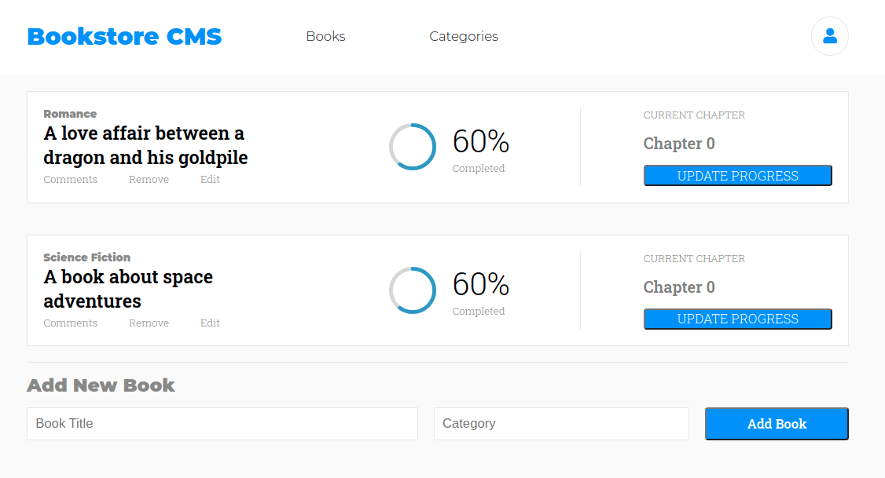

# Book Store

Book store allows you to have a list of books that you can add or remove

## Screenshot

## Built With

- React
- Redux
- SASS
- [React Circular progress bar](https://www.npmjs.com/package/react-circular-progressbar)

## Live Demo

coming soon

## Getting Started

**This is an example of how you may give instructions on setting up your project locally.**
**Modify this file to match your project, remove sections that don't apply. For example: delete the testing section if the currect project doesn't require testing.**

To get a local copy up and running follow these simple example steps.

### Prerequisites
- Node.js
### Setup
- clone the Repo: https://github.com/RokoVarano/redux-bookstore.git
### Install

- In the cloned project folder, run 'npm run start'

### Usage

- Use the top links to switch between the book lists and the categories page.
- In the books page, fill the form at the bottom to add a new book
- In each of the book widgets, you can click the 'remove' button to remove a book
- App id is generated only once and saved in local storage for testing convinience. 
If you need to reset the memory and generate a new ID, delete app_id from localStorage.

### Run tests

- coming soon

## Authors

👤 **Rodrigo Ibaceta**

- GitHub: [Rodrigo Ibaceta](https://github.com/RokoVarano/)
- Twitter: [@Rodrigo](https://twitter.com/RodrigoIbacet11)
- LinkedIn: [LinkedIn](https://www.linkedin.com/in/rodrigo-ibaceta-a8657611a/)
## 🤝 Contributing

Contributions, issues, and feature requests are welcome!

Feel free to check the [issues page](https://github.com/RokoVarano/math-magicians/issues).

## Show your support

Give a ⭐️ if you like this project!

## Acknowledgments

- Hat tip to anyone whose code was used
- Inspiration
- etc

## 📝 License

This project is [MIT](https://opensource.org/licenses/MIT) licensed.